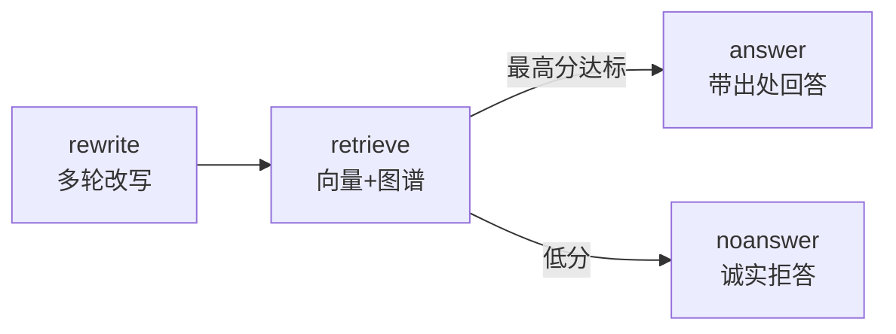

# Phase 6 家族记忆库设计文档

> 状态：已实现（`src/timememory/library/`）
> 输入：Phase 5 定稿章节 + 审核记录 + 整档片段 → 输出：子孙可问答的记忆库

---

## 1. 定稿入库（`ingest.py`，无新表）

章节作为特殊片段复用 Phase 2 四表：id 形如 `{archive}:book:{chapter_id}`，
`topic="book"`、`importance=5`，年月/人物/地点引用从成员片段继承，
正文同样向量化。访谈原话与定稿章节走同一套混合检索。

审核记录中 `存疑保留` 的条目组成待考清单（`cautions`，放会话里不入库）：
引用到含待考原文的段落时，回答必须标注"存疑待考"。

## 2. 问答图（LangGraph）



- `rewrite`：结合历史把追问改成独立可检索的一句（"他"→具体人名）；Demo 原样返回。
- `retrieve`：复用 Phase 2 `retrieve()`（向量 top_k + 图谱一跳扩展），
  另附命中片段的图谱三元组（"王二哥 -出现于→ 嘉陵江"）作为线索；章节进提示词前截断 800 字。
- `gate`：最高分低于阈值（默认 0.15）走 `noanswer`："抱歉，记忆库里没有找到相关记载。"
  宁可拒答也不编造。
- `answer`：LLM 结构化输出 `{text, citations[{passage_id, quote}], has_answer}`；
  Demo 返回首段摘录 + 出处 + 图谱线索 + 待考注。

## 3. 会话（`ChatSession`）

持有多轮历史（默认喂给改写最近 6 轮）、待考清单、阈值与 top_k。
`ask(question)` 返回 `{answer, passages, triples, standalone}`，
`passages` 含 kind/score/via/caution 供调用方展示与调试。

依赖经闭包注入；state 纯 JSON。`ChatSession` 本身持历史在内存里，
跨进程历史暂不支持（后续可接 checkpointer）。

## 4. 无 Key 行为

沿用 `TMS_LLM_*` / `TMS_EMB_*`；无 Key 时 Demo 抽取式问答离线可跑。
Demo 向量 256 维 bigram 哈希——64 维时碰撞噪声高达 0.37、真假不分，
256 维后噪声约 0.1、真匹配 0.3+，门控 0.15 才有意义（有测试锁定）。
真向量上线后按实际分数重调阈值。

## 5. 文件结构

```text
src/timememory/library/
├── models.py      Passage / Citation / Answer / Caution
├── llm.py         LibraryLLM 协议 + LangChain 真模型 + Demo 实现
├── prompts.py     改写 / 回答提示词
├── ingest.py      ingest_book：定稿入库 + 待考清单
├── pipeline.py    StateGraph（rewrite → retrieve → gate → answer/noanswer）+ ChatSession
└── __init__.py
```
