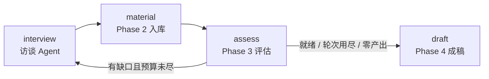

# 编排层设计文档

> 状态：已实现（`src/timememory/orchestration/`）
> 作用：访谈 Agent ↔ 写作 Agent 协作——访谈采集素材，写作评估完整度并反馈补访方向，
> 循环直到素材就绪，然后成稿。

---

## 1. 协作循环（LangGraph）



`run_memoir(elder, answer_fn, birth_year, max_rounds)` 一键跑完整本回忆录工程。
路由是确定性控制流（ready / 轮次预算 / 本轮有无产出），判断仍在各 Agent 的 LLM 里。

## 2. 共享状态（`MemoirState`）

`archive_id`（整档编号）+ `elder` + 轮次报告 + 整档评估 + 提纲 + 成稿 + 复核清单。
状态只放可序列化数据；`store` / `answer_fn` / 各 LLM 放模块注册表、
config 只传 `deps_id`。

## 3. 缺口 → 补访：提纲脚本机制

写作 Agent 的追问必须**真的被问出来**，而不只是打印在报告里：

- 补访轮把 `plan.items` 转成脚本 `[{topic_id, question}]`（每缺口最多 2 问，一轮最多 6 问），
  经 `agent.start(resume_state={"script": …})` 注入，并直切首个缺口话题、收紧轮次预算。
- Phase 1 的 `ask` 节点优先弹脚本：问题原样问出，自动切换到对应话题并盖章归属。
- 首轮零改动（无脚本时行为与原来完全一致）。

每轮会话 id 为 `{archive}-r{round}`，同档多轮素材追加到同一 store，
评估与成稿都跑在**整档**上（`session_id=None`）。

## 4. 停止条件与成稿状态

- `ready=true` → 成稿；`ready` 且零存疑为 `complete`，有存疑为 `complete_with_flags`。
- 达到 `max_rounds`（默认 3）→ 带缺口成稿（`max_rounds`）。
- 某轮零产出 → 不再空转，直接成稿。
- 复核清单（`review[]`）与成稿一起交付，给 Phase 5 人工审核。

## 5. 持久化说明

控制器编译时**不带 checkpointer**：子图 state 里放着 `store`/`llm` 对象，
嵌套 checkpoint 会序列化失败。跨天续跑靠两样已有的东西：
访谈 Agent 的 `save_session`/`resume_state`（轮内续跑），
整档 store 落盘（MySQL / SQLite 文件，轮间累积）。

## 6. 回答函数

`answer_fn(question, round_index, turn) -> str` 由调用方提供：
真人输入、模拟剧本、或以后接语音。剧本用尽请返回告别语
（如"今天有点累了，咱们下次再聊吧。"），访谈会自动收尾。

## 7. 文件结构

```text
src/timememory/orchestration/
├── models.py      MemoirState / RoundReport / 状态常量
├── pipeline.py    编排图 + run_memoir + render_memoir_report
└── __init__.py

Phase 1 配合改动（additive，无行为变化）：
interview/models.py   InterviewState += script 字段
interview/graph.py    ask 节点优先弹提纲脚本
```
