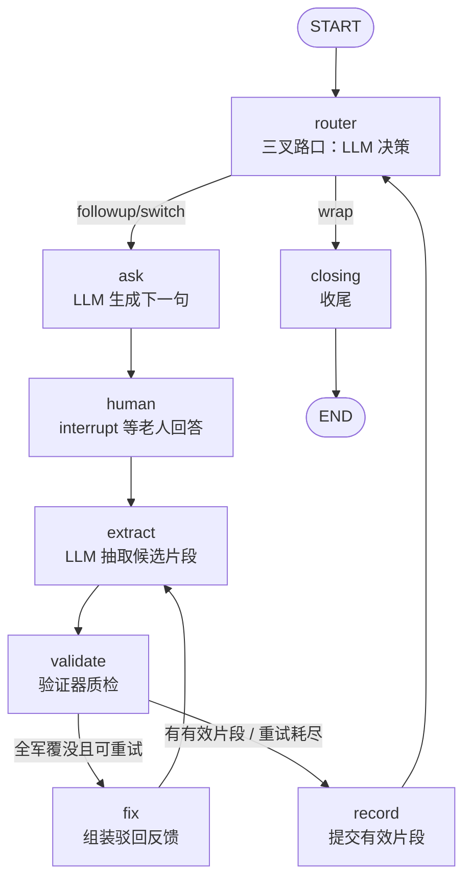

# Phase 1 初次访谈 Agent 设计文档（LangGraph 版）

> 状态：已实现（`src/timememory/interview/`），本文档与代码同步维护
> 设计原则：**判断交给 LLM，流程交给图，质量交给验证器。**
> 人工规则只保留两处：安全护栏（告别/预算）与验证器（片段质检），其余判断一律由 LLM 做出。

---

## 1. 在整条链路中的位置

```text
用户（老人家属）注册 → 填写老人基本信息
        │
        ▼
┌───────────────────────────┐
│ Phase 1: 初次访谈          │  ← 本文档
│ 访谈 Agent 与老人对话      │
│ 产出有效记忆片段           │
└────────────┬──────────────┘
             ▼
   Phase 2 素材处理 → Phase 3 写作评估 → …
```

目标：与老人自然对话 → 每轮产出**验证通过的有效记忆片段** → 输出 Phase 3 可用的完整度报告。

---

## 2. 状态图



两层 ReAct 循环：

- **外层（访谈循环）**：router 推理 → ask 行动 → human 观察 → extract 总结 → 再推理。
- **内层（抽取循环）**：extract 行动 → validate 观察 → fix 反思 → 再抽取，直到产出有效片段或重试耗尽。

---

## 3. 节点说明

| 节点 | 谁判断 | 做什么 |
|------|--------|--------|
| `router` | LLM（结构化输出 `RouteDecision`） | 三叉路口：`followup` 深挖 / `switch` 切换（须从候选话题选）/ `wrap` 收尾 |
| `ask` | LLM | 开场 / 追问 / 过渡三种话术，一次只问一个问题 |
| `human` | 老人（`interrupt` 暂停等待） | Human-in-the-loop；恢复后计数轮次 |
| `extract` | LLM（结构化输出 `FragmentBatch`） | 原话抽取时间/地点/人物/情感/重要度；修复轮带上验证反馈重抽 |
| `validate` | 验证器（见 §4） | 候选 → 有效 / 驳回（附理由） |
| `fix` | 程序组装 | 把驳回理由拼成反馈，`retries + 1` |
| `record` | 程序提交 | 有效片段盖章（话题/轮次）入库，清空本轮中间态 |
| `closing` | LLM | 回顾亮点 → 感谢 → 预告 → 告别 |

### 人工护栏（仅两处，不是判断）

1. **告别安全词**（`validators.is_farewell`）：命中无歧义告别表达 → 强制收尾。
   词表只收无歧义的（"累了/不聊了/先睡/我走了/下次再聊"），"困了/走了/再见/下次"等有歧义的一律不收，交给 LLM 按语境判断。
2. **预算护栏**：`turn_count >= max_total_turns` → 强制收尾。只管"聊多久"，不管"怎么聊"。

### 非法输出兜底

`switch` 给出的 `next_topic_id` 不在候选内 → 按人生顺序取下一个；无话题可切 → 收尾。
LLM 调用异常 → 各入口返回安全默认值（路由默认深挖、抽取返回空），访谈不中断。

---

## 4. 验证器（`validators.py`）

`validate_fragments(candidates, committed)` 是"有效片段"的唯一守门员，检查链：

1. **schema 合法**：pydantic 解析失败 → 驳回。
2. **内容非空**：正文 < 4 字 → 驳回。
3. **非纯模糊**："记不清"类表达 + 无地点/人物/情感 + 短句 → 驳回。
   "忘了"只认句尾（"早忘了"算，"忘了吃"不算）；纯时间（"很久以前"）撑不起一条记忆。
4. **非重复**：与已提交片段字符 Jaccard ≥ 0.8 → 驳回。
5. **LLM 合理性**（可选，默认开）：LLM 质检员终审；LLM 挂了则放行（fail-open）。

每条驳回都附理由，`fix` 节点把理由喂回 LLM 修复。`last_rejected` 保留在状态里便于观察。

---

## 5. LLM 抽象（`llm.py`）

`InterviewLLM` 协议定义五个判断入口：`route / ask_* / extract_fragments / closing / plausibility`。

- `LangChainInterviewLLM`：生产实现。`ChatOpenAI` 兼容接口（OpenAI / DeepSeek /
  通义千问 / 本地 Ollama，`TMS_LLM_BASE_URL` 切换），路由与抽取走 `with_structured_output`。
- `DemoInterviewLLM`：离线确定性实现，用于测试与无 Key 演示。它是"替身演员"，
  生产环境请用真模型。
- `get_llm()`：有 `TMS_LLM_API_KEY` 用真模型，否则降级 Demo。

---

## 6. 状态与持久化

`InterviewState`（TypedDict）：`messages / trail / fragments` 用 `operator.add` 追加，
其余字段覆盖写。图自带 `MemorySaver` checkpointer，`interrupt` 暂停/恢复天然支持；
`agent.save_session/load_session` 导出 JSON 快照，`start(resume_state=...)` 可跨进程恢复。

---

## 7. 交给 Phase 2 / 3 的接口（`agent.py`）

- `fragments_json()` → Phase 2：验证通过的有效片段。
- `coverage_report()` → Phase 3：各话题轮次/片段数/覆盖度/缺口/建议追问 +
  整体覆盖度 + 建议动作（`ready_for_writing / supplementary_interview / continue_interview`）+
  下次访谈计划（`resume_topics + focus_questions`，供补充访谈 `start(first_topic_id=...)` 使用）。
- `export_transcript_markdown()` → Phase 5：逐字稿 + 每轮决策轨迹。

---

## 8. 验收与测试

- `tests/test_validators.py`：放行/驳回/去重/质检/护栏（含"困难/我爹走了/改天换地"防误伤）。
- `tests/test_router.py`：好故事深挖 / 模糊切换 / 无话题收尾 / 告别收尾。
- `tests/test_graph_flow.py`：全流程 A→B→C、单问铁律、轮次上限、**修复环重试**、报告、逐字稿、会话恢复。
- `tests/test_llm_wiring.py`：真模型链路失败时各入口兜底。
- `examples/simulated_interview.py`：脚本化老人演示；`examples/demo_interview.py`：交互式 CLI。

---

## 9. 文件结构

```text
src/timememory/interview/
├── models.py      pydantic schema（片段/决策/质检）+ 图状态 + 上下文数据类
├── topics.py      人生九话题（纯数据）+ 候选/顺序兜底
├── prompts.py     全部中文提示词（路由/提问/抽取/质检/收尾）
├── llm.py         InterviewLLM 协议 + LangChain 真模型 + Demo 离线实现
├── validators.py  片段验证器 + 告别安全护栏
├── graph.py       StateGraph（router/ask/human/extract/validate/fix/record/closing）
└── agent.py       薄封装（start/step/报告/逐字稿/会话快照）
```
