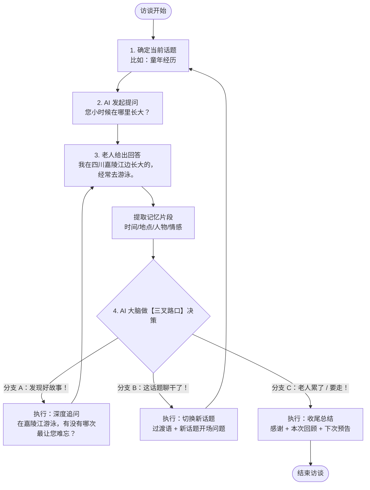
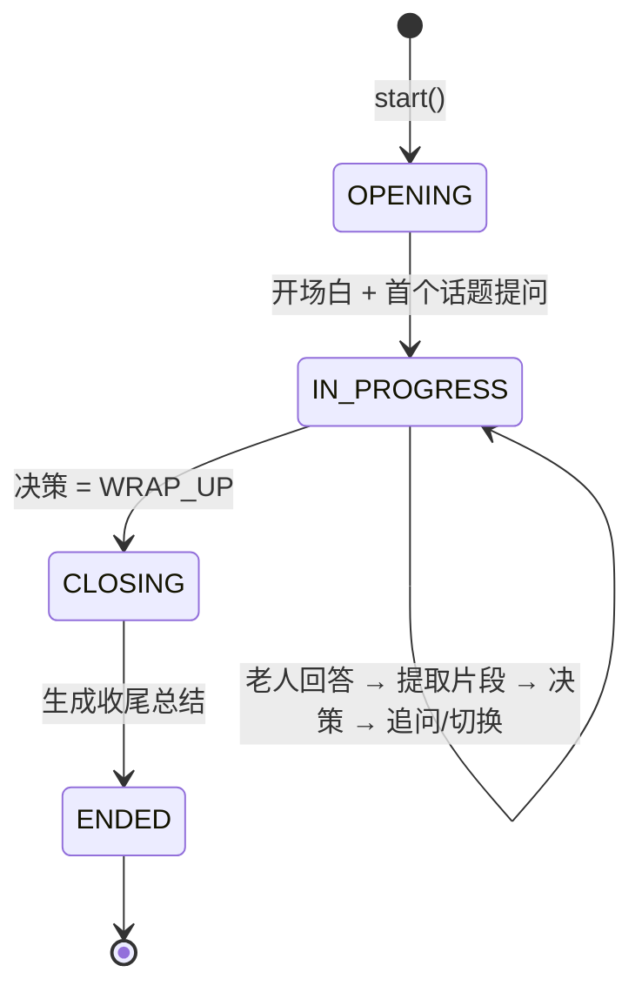

# Phase 1 初次访谈 Agent 设计文档

> 所属阶段：Phase 1 初次访谈（访谈 Agent 与老人对话，提取初始记忆片段）
> 状态：已实现（`src/timememory/interview/`），本文档与代码同步维护

---

## 1. 背景与目标

### 1.1 在整条链路中的位置

```text
用户（老人家属）注册 → 填写老人基本信息
        │
        ▼
┌───────────────────────────┐
│ Phase 1: 初次访谈          │  ← 本文档
│ 访谈 Agent 与老人对话      │
│ 提取初始记忆片段           │
└────────────┬──────────────┘
             ▼
   Phase 2 素材处理 → Phase 3 写作评估 → …
```

### 1.2 目标

- 与老人进行**自然、温暖、有节奏**的多轮对话，一次只问一个问题。
- 按「人生话题」组织访谈，保证覆盖面（童年 → 求学 → 工作 → 婚姻 → 家庭 → 见证 → 感悟）。
- 从每轮回答中提取**结构化记忆片段**（时间 / 地点 / 人物 / 情感 / 重要度），供 Phase 2/3 使用。
- 自动判断三种局面并采取行动：**深挖好故事 / 切换聊干的话题 / 老人累了就收尾**。
- 输出 Phase 3 可用的**素材完整度报告**（覆盖了什么、缺什么、下次追问什么）。

### 1.3 非目标

- 不做语音识别 / 合成（由接入层负责，本 Agent 只处理文本）。
- 不做长期记忆库与向量检索（那是 Phase 2 的职责）。
- 不替老人做医疗、心理诊断；遇到敏感内容只倾听、不评判，必要时提示家属。

---

## 2. 总体流程



### 2.1 状态机



---

## 3. 核心：三叉路口决策引擎（`decision.py`）

这是整个 Agent 最核心的一步。每一轮老人回答后，决策引擎输出三者之一：

| 分支 | 动作 | 含义 | 触发信号举例 |
|------|------|------|--------------|
| A | `DEEP_DIVE` 深度追问 | 回答里有好故事，值得深挖 | 具体人名/地名/时间、情感浓度高、有冲突转折、提到未展开的实体 |
| B | `SWITCH_TOPIC` 切换话题 | 当前话题聊干了 / 老人没货了 | "记不清了""没什么了"、回答越来越短、重复已有信息、单话题轮次超限 |
| C | `WRAP_UP` 收尾结束 | 老人累了 / 想离开 / 轮次用完 | "累了""下次吧""要休息了"、连续极短回复、总轮次达上限 |

### 3.1 三层融合架构

```text
老人回答 + 会话状态
        │
        ▼
┌─────────────────┐
│ 第 1 层：硬规则  │  显式告别 / 疲惫关键词 / 轮次上限 → 直接 WRAP_UP（一票否决）
│ (Rule Veto)     │  单话题轮次超限 → SWITCH（除非无话题可切则 WRAP_UP）
└────────┬────────┘
         ▼
┌─────────────────┐
│ 第 2 层：特征打分│  story_value（故事价值分 0~1）
│ (Heuristic)     │  exhaustion（话题枯竭分 0~1）
│                 │  fatigue（疲惫分 0~1）
└────────┬────────┘
         ▼
┌─────────────────┐
│ 第 3 层：LLM 裁判│  把上下文喂给 LLM，打出结构化裁决
│ (LLM Judge)     │  {action, confidence, reasoning, focus}
└────────┬────────┘
         ▼
   加权融合 → 最终决策（含可解释的 reasoning）
```

**为什么三层？**

- 第 1 层保证**底线**：老人说累了必须立刻收尾，不能"再追问一个问题"——这是对老人的尊重，也是安全红线。不依赖 LLM，永远生效。
- 第 2 层保证**可测试、可离线运行**：特征分用正则 + 词表 + 统计实现，无 LLM 也能工作，是单元测试的主要对象。
- 第 3 层提供**语义理解上限**：LLM 能读懂"话里有话"（比如老人欲言又止、话题漂移），弥补规则的死板。

### 3.2 特征分细则

**`story_value` 故事价值分**（越高越值得追问）：

- 实体密度：时间表达（×年/×岁/小时候/那时候）、地点表达（×江/×村/×学校…）、人物表达（爷爷/奶奶/老师/邻居…），每类命中加分。
- 叙事标记：后来 / 然后 / 有一次 / 最难忘 / 没想到 / 结果…（说明有情节）。
- 情感词：开心 / 害怕 / 难过 / 骄傲 / 想念…（说明有情绪）。
- 长度加成：回答越具体通常越长（封顶，避免话痨刷分）。

**`exhaustion` 话题枯竭分**（越高越该切换）：

- 模糊表达："不知道 / 不记得 / 记不清 / 忘了 / 没什么 / 就那样"。
- 极短回复（< 6 字）且无实体。
- 与历史回答高度重复（字符级 Jaccard 相似度）。
- 信息增量低：本轮没出现新实体，且话题已聊 ≥ min_turns。
- 单话题轮次逼近 max_turns 时线性爬升。

**`fatigue` 疲惫分**（越高越该收尾）：

- 显式信号："累 / 困 / 休息 / 下次 / 改天 / 不聊了 / 吃饭 / 睡觉 / 有事 / 再见" → 直接拉满。
- 连续极短回复 streak ≥ 3。
- 总轮次逼近上限时线性爬升（ soft 封顶，硬上限在第 1 层）。

### 3.3 融合与阈值（默认配置，可调）

```text
if 显式告别/疲惫关键词 or 总轮次 >= max_total_turns:      → WRAP_UP（硬规则）
elif 单话题轮次 >= max_turns_per_topic:                   → SWITCH（无话题可切则 WRAP_UP）
else:
    计算三项特征分 +（可选）LLM 裁决，加权融合
    if fatigue   >= 0.75:                                 → WRAP_UP
    elif exhaustion >= 0.85:                              → SWITCH（即使没聊够 min_turns，老人没货就不硬聊）
    elif exhaustion >= 0.60 and story_value < 0.50
         and 话题轮次 >= min_turns:                        → SWITCH
    elif story_value >= 0.35:                             → DEEP_DIVE（深挖成本低，漏故事代价高，阈值宜低）
    elif 话题轮次 < min_turns:                            → DEEP_DIVE（再给一次机会）
    else:                                                 → SWITCH
```

所有阈值收敛在 `AgentConfig` 中，支持按老人状态调整（比如 90 岁高龄老人调小 `max_total_turns`）。

---

## 4. 话题库设计（`topics.py`）

### 4.1 人生九话题

按中国老人一生时间线 + 记忆特点编排：

| 顺序 | 话题 id | 话题名 | 开场问题示例 |
|------|---------|--------|--------------|
| 1 | `childhood` | 童年经历 | 您小时候在哪里长大？家里是什么样的？ |
| 2 | `hometown` | 故乡与故土 | 您的老家是什么样的？还记得老屋吗？ |
| 3 | `education` | 求学经历 | 您小时候读过书吗？还记得学校和老师吗？ |
| 4 | `youth_work` | 青年与工作 | 您年轻时做过什么工作？第一份工还记得吗？ |
| 5 | `love_marriage` | 爱情与婚姻 | 您和老伴是怎么认识的？ |
| 6 | `family_children` | 家庭与子女 | 孩子出生时您还记得吗？带孩子最操心的是什么？ |
| 7 | `hard_times` | 艰难岁月 | 那些年最难的时候，您是怎么熬过来的？ |
| 8 | `craft_hobby` | 手艺与爱好 | 您有什么拿手的本事，或者喜欢的消遣？ |
| 9 | `wisdom` | 人生感悟 | 如果跟孙辈说一句最想说的话，您会说什么？ |

> `hard_times`（饥荒 / 动荡 / 丧亲等）是敏感话题：只在老人主动提及或访谈后期、信任建立后才由 Planner 引入，且提问必须温和、允许跳过。

每个话题包含：`id / name / description / opening_questions（3 个）/ followup_angles（追问角度）/ keywords（ bridging 用）/ min_turns / max_turns / priority / sensitive（是否敏感）`。

### 4.2 话题规划器（TopicPlanner）

切换话题时不是简单按顺序 next，而是：

1. 过滤已覆盖话题；
2. **搭桥加分**：如果老人刚才提到的实体命中某未覆盖话题的 keywords（比如聊童年时提到"私塾先生"→ 搭桥到 `education`），优先切过去，对话更自然；
3. 敏感话题默认排到最后，且需要 `trust_level`（已访谈轮次）达标；
4. 返回 `(新话题, 过渡语素材)`，过渡语示例：
   > "刚才您讲的在嘉陵江游泳的事真有意思。说到小时候，我想问问——您那时候读过书吗？"

---

## 5. 提问策略（`questions.py`）

### 5.1 对老人友好的提问铁律（写入 System Prompt + 模板约束）

1. **一次只问一个问题**，短句，口语，不用书面语 / 网络词。
2. 尊称"您"，多用"那时候""后来呢"这类引导词。
3. 先**复述确认**（"您是说…对吗？"）再追问，让老人感到被听见。
4. 不预设答案，不诱导，不评判价值观。
5. 敏感话题：温和、可跳过——"这个要是不想提，咱们就跳过，没关系。"

### 5.2 追问五板斧（DEEP_DIVE 策略池）

| 策略 | 说明 | 示例 |
|------|------|------|
| `entity_expand` 实体展开 | 挑一个未展开过的实体深挖 | "您刚才提到嘉陵江——在江边游泳，有哪次最让您难忘？" |
| `emotion_deepen` 情感加深 | 追情绪 | "那一刻您心里是什么感觉？害怕还是开心？" |
| `sensory_detail` 感官细节 | 追画面/声音/味道 | "那条江是什么样的？水清吗？岸边都有啥？" |
| `event_chain` 事件链条 | 追前因后果 | "后来呢？这件事最后怎么样了？" |
| `example_request` 要个例子 | 抽象变具体 | "能给我讲一个具体的例子吗？" |

选择逻辑：优先未展开过的**地点/人物实体**（故事性最强）→ 其次情感 → 其次事件链；`expanded_entities` 记录已追问过的实体，避免车轱辘话。

### 5.3 首问与收尾

- **首问**：固定从 `childhood` 开始（童年记忆最久远也最安全），开场白介绍身份 + 访谈目的 + 时长预期，降低老人戒备。
- **收尾**：回顾本次聊到的 2~3 个亮点 → 感谢 → 预告下次 → 温暖告别。收尾文本由模板 + 本次记忆片段自动组装，不依赖 LLM 也能生成。

---

## 6. 记忆片段提取（`extractor.py`）

每轮老人回答都会被切成 1~N 个**记忆片段**（MemoryFragment）：

```python
MemoryFragment(
    id="frag-0007",
    content="我在四川嘉陵江边长大的，经常去游泳。",  # 原文（尽量不动）
    topic_id="childhood",
    time_refs=["小时候"],        # 时间表达
    place_refs=["四川", "嘉陵江"], # 地点表达
    person_refs=[],              # 人物表达
    emotion="怀念",               # 情感倾向（可空）
    importance=4,                # 1~5，故事价值
    entities=["四川", "嘉陵江", "游泳"],
    needs_followup=True,         # 是否值得追问
    followup_hint="嘉陵江：可追问游泳趣事/难忘经历",
    source_turn=2,
)
```

实现：**规则打底 + LLM 精修（可选）**。

- 规则层：按 `。！？；` 分句，过滤语气词（"嗯""好的"），正则抽时间/地点/人物，词表判情感，启发式打重要度。
- LLM 精修：把规则结果 + 原文发给 LLM，修正指代、补全要素、重写 `followup_hint`。LLM 不可用时直接用规则结果。

---

## 7. 会话管理与持久化

- `InterviewState` 持有全部会话状态：老人画像、当前话题、轮次计数、消息列表、记忆片段、已展开实体、短回复 streak。
- `session.py` 提供 JSON 落盘 / 恢复，支持"老人中途离开、下次继续"（补充访谈复用同一套状态机，Phase 1 ↔ Phase 3 的循环在外层调度）。
- 补充访谈（针对缺口）：调用方指定 `resume_topics=[...]` + `focus_questions=[...]`，Agent 从指定话题开始，状态机逻辑不变。

---

## 8. LLM 抽象与降级（`llm.py`）

```text
LLMClient（抽象接口：chat(system, user) -> str）
    ├── MockLLMClient        离线默认：确定性模板回复，用于测试/演示
    └── OpenAICompatibleClient  标准库 urllib 实现，兼容 OpenAI / DeepSeek /
                               通义千问 / 本地 Ollama（OpenAI 协议）
```

- 通过环境变量切换：`TMS_LLM_BASE_URL / TMS_LLM_API_KEY / TMS_LLM_MODEL`，有 Key 就用真模型，无 Key 自动降级 Mock——**核心链路（决策/提问/提取）都有规则兜底，真·零依赖可跑**。
- 所有 LLM 调用都要求**输出 JSON**（决策、提取）或**单句问句**（提问），并做解析失败重试 + 规则回退。

---

## 9. 交给 Phase 2 / 3 的接口（`report.py` + `agent.py`）

访谈结束（或每轮）可导出：

1. **记忆片段列表** `fragments: list[MemoryFragment]` → Phase 2 清洗/向量化/知识图谱的输入。
2. **素材完整度报告** `coverage_report()` → Phase 3 写作评估的输入：

```json
{
  "session_id": "iv-2026-001",
  "topics": {
    "childhood": {"turns": 5, "fragments": 6, "coverage": 0.8,
                  "gaps": ["缺少具体年份", "未提及父母"],
                  "suggested_questions": ["您是哪一年出生的？", "您父母是做什么的？"]},
    "education": {"turns": 0, "fragments": 0, "coverage": 0.0,
                  "gaps": ["完全未覆盖"], "suggested_questions": ["您读过书吗？"]}
  },
  "overall_coverage": 0.42,
  "recommendation": "supplementary_interview",
  "next_interview_plan": {"resume_topics": ["education", "youth_work"], "focus_questions": ["..."]}
}
```

3. **逐字稿 Markdown** `export_transcript_markdown()` → Phase 5 人工审核时家属可读。

---

## 10. 评估指标（Phase 1 验收标准）

| 指标 | 定义 | 目标 |
|------|------|------|
| 话题覆盖率 | 覆盖话题数 / 9 | 首访 ≥ 3 个话题 |
| 片段产出率 | 记忆片段数 / 老人回答轮数 | ≥ 0.8 |
| 深挖命中率 | DEEP_DIVE 后老人回答长度/实体数提升的比例 | ≥ 60% |
| 疲惫响应率 | 老人表达累/走后 1 轮内收尾的比例 | 100%（红线） |
| 单问合规率 | AI 每轮只问一个问题的比例 | 100% |
| 老人打断率 | 老人主动说"换个话题/别问了"的比例 | 越低越好 |

---

## 11. 安全与伦理（老人关怀红线）

1. 老人说累 / 要走 → **必须收尾**，不许"再问最后一个问题"。
2. 单轮总时长建议 ≤ 30 分钟（`max_total_turns` 默认 30，可按语速折算）。
3. 敏感话题（丧亲、饥荒、动荡）只跟随、不主动深挖；老人情绪低落时切换到温暖话题。
4. 不记录、不追问身份证号、银行卡、密码等隐私信息（规则层过滤提示）。
5. 所有 AI 生成内容标注可溯源（`source_turn`），Phase 5 人工审核前不作为定稿。

---

## 12. 文件结构

```text
src/timememory/interview/
├── __init__.py      包导出
├── models.py        数据模型：Topic / Message / MemoryFragment / Decision / InterviewState / AgentConfig
├── topics.py        人生九话题库 + TopicPlanner（搭桥切换）
├── prompts.py       全部 LLM 提示词（中文）
├── llm.py           LLM 抽象：Mock + OpenAI 协议（标准库 urllib，零依赖）
├── extractor.py     记忆片段提取（规则打底 + LLM 精修）
├── decision.py      三叉路口决策引擎（三层融合：硬规则 → 特征分 → LLM 裁判）
├── questions.py     提问生成器（开场 / 五板斧追问 / 过渡 / 收尾）
├── agent.py         InterviewAgent 编排器（状态机 + 对外 API）
├── session.py       会话 JSON 持久化
└── report.py        Phase 3 交接：完整度报告 + 缺口分析 + 下次访谈计划

tests/test_*.py      单元测试（标准库 unittest，零依赖）
examples/
├── simulated_interview.py  模拟老人全流程演示（含 A/B/C 三分支）
└── demo_interview.py       交互式 CLI（你扮演老人）
```
