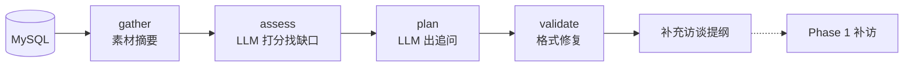

# Phase 3 写作评估设计文档

> 状态：已实现（`src/timememory/assessment/`）
> 输入：Phase 2 入库的素材（片段 + 知识图谱）→ 输出：评估报告 + 补充访谈提纲（回 Phase 1 补访）

---

## 1. 流水线（LangGraph）



`run_assessment(store, session_id)` 一键跑完。判断（够不够写、缺什么、怎么问）由 LLM 做，
`validate` 只做确定性格式修复（非法话题丢弃、问题去重截断、同话题合并）。

## 2. 素材摘要（`stats.py`，纯规则）

把库压缩成 LLM 能一口吃下的 JSON：话题覆盖（9 话题计数/空缺/单薄）、
年份与年代空洞、实体提及次数（图谱边计数）、情感覆盖率、平均重要度、
每话题最多 2 条原文（截断 80 字，避免提示词爆炸）。

## 3. 评估（`assess`，LLM 结构化输出）

四个维度 0–10 打分：话题覆盖 / 时间线完整 / 人物丰满度 / 细节情感，
外加 `ready`（够不够动笔）、亮点、缺口清单（最多 6 个，按重要性排序）。

每个缺口必须带 `topic_id`（取自 Phase 1 九话题之一）——这是回访入口；
人物类缺口把人名填进 `subject`，供追问生成使用。

## 4. 补充访谈计划（`plan`，LLM 结构化输出）

每个缺口转成一个话题的补访任务：1–3 个口语化追问（一次只问一件事），
同话题合并。`render_brief()` 渲染成给访谈员看的 Markdown 提纲。

## 5. 无 Key 行为

沿用 `TMS_LLM_*` 环境变量；无 Key 时 `DemoAssessmentLLM` 按规则打分、
用 Phase 1 话题的开场白做追问模板，离线可跑、输出确定（有测试锁定）。

## 6. 交给下游的接口

- Phase 1 补访：`plan.items[].{topic_id, questions}` 即下一轮访谈提纲。
- Phase 4 写作：将消费 `assessment`（素材水位）+ 全库片段动笔。

## 7. 文件结构

```text
src/timememory/assessment/
├── models.py      Assessment / Gap / SupplementPlan…
├── stats.py       gather_stats：确定性素材摘要
├── llm.py         AssessmentLLM 协议 + LangChain 真模型 + Demo 实现
├── prompts.py     评估 / 访谈计划提示词
├── pipeline.py    StateGraph（gather → assess → plan → validate）
└── brief.py       render_brief：Markdown 提纲渲染
```
