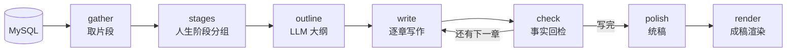

# Phase 4 初稿生成设计文档

> 状态：已实现（`src/timememory/drafting/`）
> 输入：Phase 2 素材 + Phase 3 评估 → 输出：回忆录初稿 Markdown（含存疑批注与复核清单）

---

## 1. 流水线（LangGraph）



`run_drafting(store, session_id, elder, birth_year, assessment)` 一键成稿。

## 2. 人生阶段分组（`stages.py`，纯规则）

按片段中的年份分组：有出生年 → 按年龄映射 童年/少年/青年/中年/晚年；
无出生年 → 按年代分组。无年份片段单独列出，由大纲环节归位到各章。

## 3. 章节大纲（`outline`，LLM 结构化输出）

每个人生阶段至少一章；无年份素材必须全部分配、不重不漏；章节按时间排序。
`normalize_outline` 做确定性修补：id 去重、丢未知 id、丢空章、
遗漏素材自动补进末章（一个片段都不许丢）。

## 4. 逐章写作（`write`，LLM）

第一人称口述体（"我"），有温度有细节；铁律：只写素材里有的事。
每章输入：本章素材 + 上一章摘要（保持连贯、不重复）。

## 5. 事实回检（`check`，LLM 结构化输出）

逐句核对人名/地名/年份/数字/因果，素材无出处即判存疑（年份对不上判错误）。
**不通过不阻断**：挂批注进附录、留人工复核入口（存疑原文 + 查证片段范围），
流程继续，最后由 Phase 5 人工审核定夺。

## 6. 统稿（`polish`，LLM）与渲染（`render`）

统稿只做衔接：加《序》《尾声》与章间过渡，**不得改写各章正文一字、
不得增加任何事实**（重写会引入新幻觉；风格统一靠写作提示词的 tone 规范）。
渲染输出完整 Markdown：封面（口述/整理/日期）+ 目录 + 正文
+ 附录一（存疑批注与人工复核清单）+ 附录二（章节 ↔ 片段溯源）。

## 7. 无 Key 行为

沿用 `TMS_LLM_*`；无 Key 时 Demo 按规则分章、拼接原文成章、
检查年份出处（素材年份所在年代视为有出处），离线可跑、输出确定。

## 8. 交给下游的接口

- Phase 5 人工审核：`manuscript` 全文 + `review[]` 复核清单（章/原文/问题/查证范围）。
- Phase 6 记忆库：成稿入库后可整本检索（与片段检索互补）。

## 9. 文件结构

```text
src/timememory/drafting/
├── models.py      Outline / ChapterSpec / ChapterDraft / FactCheck / ReviewItem…
├── stages.py      group_stages：人生阶段分组（纯规则）
├── llm.py         DraftingLLM 协议 + LangChain 真模型 + Demo 实现
├── prompts.py     大纲 / 写作 / 回检 / 统稿提示词
├── pipeline.py    StateGraph（gather → stages → outline → write ⇄ check → polish → render）
└── manuscript.py  render_manuscript：成稿渲染
```
