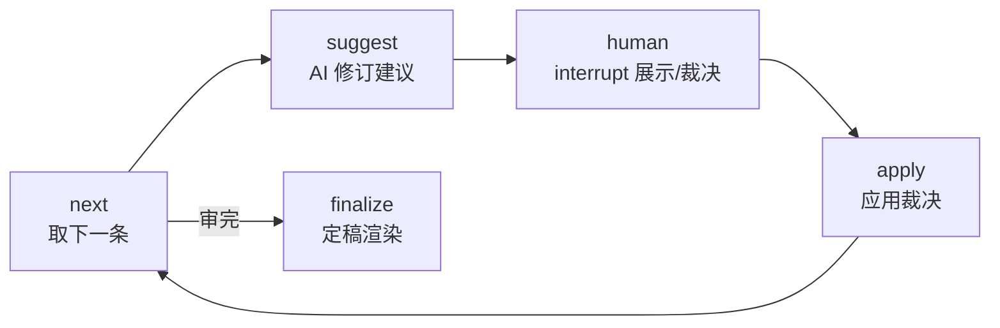

# Phase 5 人工审核设计文档

> 状态：已实现（`src/timememory/review/`）
> 输入：Phase 4 初稿 + 复核清单 → 输出：定稿（修正后正文 + 审核记录 + 溯源）

---

## 1. 审核流水线（LangGraph）



`run_review(drafts, review_items, fragments, decide_fn=…)` 一键审完。
`decide_fn(展示包)` 由调用方提供（终端输入或脚本），返回裁决；
展示包 keys：`position/total/item/suggestion/chapter_title/excerpt/materials`。
零存疑时直接定稿，不打扰人。

## 2. AI 修订建议（LLM 结构化输出）

每条存疑先过 LLM：`保留 / 改写 / 删除该句` + 改写句 + 一句话理由。
要求最小化修订——优先用素材内容改写，素材完全没提才删，
只有核查有误才保留并说明出处。无 Key 时 Demo 建议删除无出处内容。

## 3. 人工裁决（四选一）

- **确认无误**：问过老人属实，正文不动。
- **已修正**：用审核人给的改写句替换原句；没给改写句时，
  若 AI 建议是删除则采纳删除，否则降级为存疑保留。
- **存疑保留**：正文不动，记入审核记录（宁可保留疑问也不乱改）。
- **删除相关句**：删掉存疑句子。

未知裁决值降级为存疑保留；原句定位不到时不动正文并注明。
所有裁决（含 AI 建议、备注、是否改动正文）写入附录一审计记录，
原文永久可查——改了什么、为什么改，一目了然。

## 4. 定稿渲染

封面（口述/审核人/定稿日期/V1.0，标题"初稿"→"定稿"）+ 目录
+ 修正后正文 + 附录一（审核记录）+ 附录二（素材溯源）。

## 5. 交互入口

- `examples/review_cli.py`：交互式——访谈成书 → 逐条裁决 → 定稿写入 `data/final_book.md`。
- `examples/review_demo.py`：脚本化演示（含一条存疑改写的合成示例）。
- LLM 经闭包注入、不进 state，state 纯 JSON 可序列化（MemorySaver 可用）。

## 6. 交给下游的接口

- Phase 6 家族记忆库：定稿全文 + 审核记录入库，可整本检索；
  `存疑保留` 的条目是记忆库标注"待考"的依据。

## 7. 文件结构

```text
src/timememory/review/
├── models.py      FixSuggestion / ItemReview / ChapterFinal
├── llm.py         ReviewLLM 协议 + LangChain 真模型 + Demo 实现
├── prompts.py     修订建议提示词
├── pipeline.py    StateGraph（next → suggest → human ⇄ apply → finalize）+ run_review
├── book.py        render_final_book：定稿渲染
└── __init__.py
```
